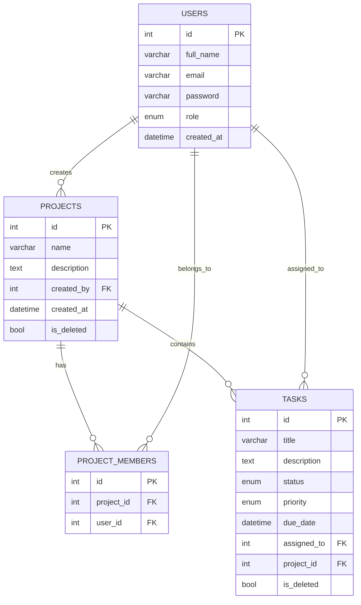

# Project Management API with Role-Based Access Control

A FastAPI backend application for managing projects, tasks, and role-based permissions.

## Features
- JWT authentication and user management
- Role-based access control: Admin, Manager, Member
- Project CRUD with soft delete support
- Project membership assignment and member listing
- Task CRUD with assignment, status, priority, and soft delete
- Role-based access control and project membership
- Project-level and overall analytics endpoints

## Roles and permissions
- `Admin`
  - full access to all endpoints
  - can create users, projects, and tasks
- `Manager`
  - can create projects and tasks
  - can manage projects where they are a member
  - can add project members and manage related tasks
- `Member`
  - can view assigned tasks and project content
  - can update task `status` or `priority` only for assigned tasks

## Installation
1. Create a virtual environment
   ```bash
   python -m venv .venv
   .\.venv\Scripts\activate
   ```
2. Install dependencies
   ```bash
   pip install -r requirements.txt
   ```
3. Run database migrations (optional)
   ```bash
   alembic upgrade head
   ```
4. Start the application
   ```bash
   uvicorn app.main:app --reload
   ```

   Or from the project root with the top-level entrypoint:
   ```bash
   uvicorn main:app --reload
   ```

## Configuration
- The app uses SQLite by default and stores the database in `app.db`.
- No extra environment variables are required for a local development run unless you add custom settings.

## Project structure
```
Project Management API with Role-Based Access Control/
│
├── alembic.ini
├── main.py
├── postman_collection.json
├── README.md
├── requirements.txt
├── repro_login.py
├── app.db
│
├── alembic/
│   ├── env.py
│   ├── script.py.mako
│   └── versions/
│       └── 0001_initial.py
│
├── app/
│   ├── __init__.py
│   ├── database.py
│   ├── main.py
│   ├── models.py
│   ├── schemas.py
│   ├── utils.py
│   └── routers/
│       ├── __init__.py
│       ├── auth.py
│       ├── members.py
│       ├── projects.py
│       ├── tasks.py
│       └── users.py
│
└── tests/
    ├── conftest.py
    ├── test_auth.py
    ├── test_project.py
    └── test_rbac.py
```

## Database schema
The application uses four main tables to support users, projects, tasks, and project membership.



- `users` stores application users with roles: `Admin`, `Manager`, `Member`.
- `projects` stores project details and supports soft delete via `is_deleted`.
- `project_members` links users to projects for membership and permission checks.
- `tasks` stores task details, assignment, project association, and soft delete via `is_deleted`.

## Authentication
### Signup
- Endpoint: `POST /auth/signup`
- Request body (JSON):
  ```json
  {
    "full_name": "Admin User",
    "email": "admin@example.com",
    "password": "strongpassword",
    "role": "Admin"
  }
  ```
- Response: user object

### Login
- Endpoint: `POST /auth/login`
- Request type: form data (OAuth2 password grant)
- Fields:
  - `username`: user email
  - `password`: user password
  - `role` (optional): user role
- Example using `curl`:
  ```bash
  curl -X POST "http://127.0.0.1:8000/auth/login" \
    -d "username=admin@example.com" \
    -d "password=strongpassword" \
    -d "role=Admin"
  ```
- Response:
  ```json
  {
    "access_token": "<TOKEN>",
    "token_type": "bearer"
  }
  ```

### Authenticated requests
- Use the returned token in the `Authorization` header:
  ```http
  Authorization: Bearer <TOKEN>
  ```

> Note: In the provided Postman collection, `base_url` is already set as a collection variable and the `Login` request saves `access_token` automatically. After running `Login` once, protected requests can use `Bearer {{access_token}}` without manually pasting the token each time.

## API Reference

### Projects
#### Create project
- `POST /projects`
- Roles: `Admin`, `Manager`
- Request body:
  ```json
  {
    "name": "New Project",
    "description": "Project description"
  }
  ```

#### List projects
- `GET /projects`
- Optional query parameters:
  - `search` (string)
  - `page` (int)
  - `page_size` (int)

#### Get project details
- `GET /projects/{project_id}`

#### Update project
- `PUT /projects/{project_id}`
- Roles: `Admin`, `Manager` (if project member)
- Request body:
  ```json
  {
    "name": "Updated Project",
    "description": "Updated description"
  }
  ```

#### Delete project (soft delete)
- `DELETE /projects/{project_id}`
- Roles: `Admin`

#### Project analytics
- `GET /projects/{project_id}/analytics`
- Roles: `Admin`, `Manager`, `Member` (if project member)

#### Overall analytics
- `GET /projects/analytics`
- Roles: `Admin`, `Manager`

### Project members
#### Add member
- `POST /projects/{project_id}/members`
- Roles: `Admin`, `Manager`
- Request body:
  ```json
  {
    "user_id": 2
  }
  ```

#### List members
- `GET /projects/{project_id}/members`

### Tasks
#### Create task
- `POST /tasks`
- Roles: `Admin`, `Manager`
- Request body:
  ```json
  {
    "title": "Task title",
    "description": "Task details",
    "status": "Pending",
    "priority": "High",
    "due_date": "2026-08-01T12:00:00Z",
    "assigned_to": 3,
    "project_id": 1
  }
  ```

#### List tasks
- `GET /tasks`
- Optional filters:
  - `status`
  - `priority`
  - `assigned_to`
  - `project_id`
  - `page`
  - `page_size`

#### Get task details
- `GET /tasks/{task_id}`

#### Update task
- `PUT /tasks/{task_id}`
- Members may only update `status` or `priority` for assigned tasks.
- Managers may update tasks for their projects.
- Admins may update any task.

#### Delete task (soft delete)
- `DELETE /tasks/{task_id}`
- Roles: `Admin`, `Manager`

### User management
#### List users
- `GET /users`
- Roles: `Admin`, `Manager`

#### Get user details
- `GET /users/{user_id}`
- Roles: `Admin`, `Manager`

#### Update user
- `PUT /users/{user_id}`
- Roles: `Admin`
- Request body fields are optional:
  ```json
  {
    "full_name": "Updated Name",
    "email": "new@example.com",
    "password": "newpassword",
    "role": "Manager"
  }
  ```

#### Delete user (soft delete)
- `DELETE /users/{user_id}`
- Roles: `Admin`
- Soft deletes the user so related projects/tasks remain intact

## Postman collection
- A Postman collection is available in `postman_collection.json` for testing the API endpoints.

## Testing
Run the full test suite with:
```bash
pytest -q tests
```

## Notes
- The default SQLite database file is `app.db`.
- `Admin` has unrestricted access.
- `Manager` is limited to projects they belong to and their tasks.
- `Member` can only view tasks assigned to them and update task status or priority.
